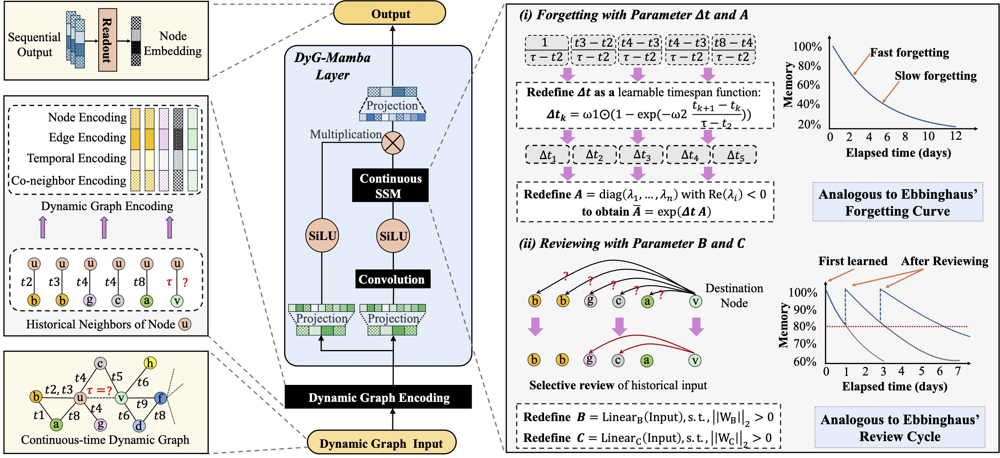
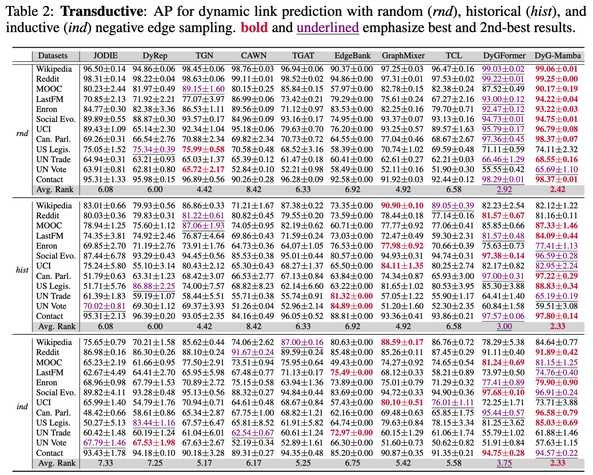
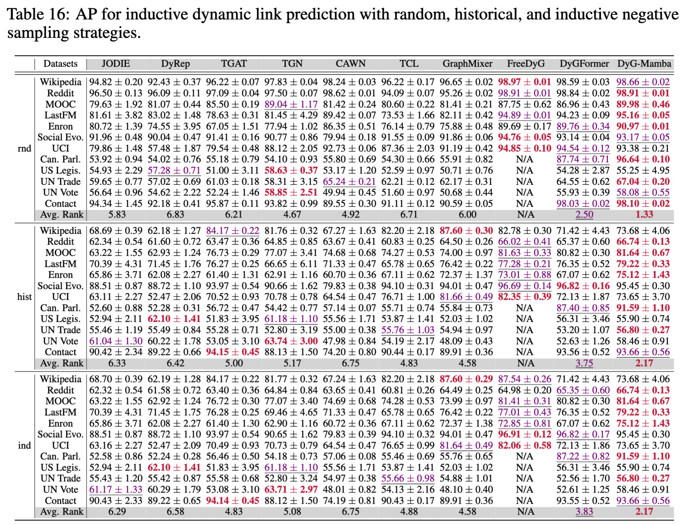

<h1 align="center">
  DyG-Mamba 🚀
</h1>

<h3 align="center">
  Continuous State Space Modeling on Dynamic Graphs
</h3>

<p align="center">
  <strong>Accepted at NeurIPS 2025</strong>
</p>

<p align="center">
  <a href="https://openreview.net/forum?id=ja2wA4UncJ">
    
  </a>
  
  
  
</p>




---
## Preprints

[](https://arxiv.org/pdf/2408.06966)

---

## 🔍 Overview

This repository contains the official implementation of **“Continuous State Space Modeling on Dynamic Graphs” (DyG-Mamba)**.

TL,DR: DyG-Mamba is a novel **continuous-time state space model (SSM)** designed for **dynamic graph learning under irregular temporal sampling**. Unlike prior approaches that treat node or edge features as control signals—an assumption that fails under irregular timestamps—DyG-Mamba **directly leverages irregular time spans as control signals**. This design leads to significantly improved **temporal sensitivity, robustness, and generalization** across dynamic graph tasks.

---

## Performance on Dynamic Graph Benchmarks





---


## ⚙️ Requirements

This codebase is built upon and modified from  
👉 [DyGLib](https://github.com/yule-BUAA/DyGLib)

**Tested environment**
- Python **3.10.13**
- CUDA **11.8**

### Installation

```bash
pip install torch==2.1.0 torchvision==0.16.0 torchaudio==2.1.0 \
  --index-url https://download.pytorch.org/whl/cu118

pip install tqdm tabulate scipy scikit-learn
pip install mamba-ssm
```
---

## 📊 Benchmarks & Preprocessing

DyG-Mamba is evaluated on **12 real-world dynamic graph datasets**:

- **Bipartite graphs**: Wikipedia, Reddit, MOOC, LastFM, Enron
- **Homogeneous graphs**: Social Evo., UCI, Can. Parl., US Legis., UN Trade, UN Vote, Contact

Most datasets are sourced from  👉 *Towards Better Evaluation for Dynamic Link Prediction* [NeurIPS'22]  
  - [OpenReview](https://openreview.net/forum?id=1GVpwr2Tfdg)
  - [Zenodo](https://zenodo.org/record/7213796#.Y1cO6y8r30o)

### Data Preparation

Download the datasets and place them under: DG_data/


### Preprocess a Single Dataset

```bash
cd preprocess_data/
python preprocess_data.py --dataset_name wikipedia
```

### Preprocess All Datasets

```bash
cd preprocess_data/
python preprocess_all_data.py
```
---

## 🚀 Running the Code

DyG-Mamba supports:

- Dynamic link prediction (transductive & inductive)
- Multiple negative sampling strategies  
  *(random / historical / inductive)*
- Dynamic node classification


### 🔗 Dynamic Link Prediction (Training)

```bash
python train_link_prediction.py \
  --dataset_name ${dataset_name} \
  --model_name DyG-Mamba \
  --gpu ${gpu}
```

### 📈 Dynamic Link Prediction (Evaluation)

```bash
python evaluate_link_prediction.py \
  --dataset_name ${dataset_name} \
  --model_name DyG-Mamba \
  --negative_sample_strategy ${negative_sample_strategy} \
  --gpu ${gpu}
```

### 🧠 Dynamic Node Classification (Training)

Supported on **Wikipedia** and **Reddit** only.

```bash
python train_node_classification.py \
  --dataset_name ${dataset_name} \
  --model_name DyG-Mamba \
  --gpu ${gpu}
```

### 🧪 Dynamic Node Classification (Evaluation)

```bash
python evaluate_node_classification.py \
  --dataset_name ${dataset_name} \
  --model_name DyG-Mamba \
  --gpu ${gpu}
```

---

## 📌 Citation

If you find this work helpful, we would appreciate it if you could cite our paper:

```bibtex
@inproceedings{Dyg-Mamba,
  title     = {DyG-Mamba: Continuous State Space Modeling on Dynamic Graphs},
  author    = {Dongyuan Li and Shiyin Tan and Ying Zhang and Ming Jin and
               Shirui Pan and Manabu Okumura and Renhe Jiang},
  booktitle = {The Thirty-ninth Annual Conference on Neural Information Processing Systems},
  year      = {2025},
  url       = {https://openreview.net/forum?id=ja2wA4UncJ}
}
```

```bibtex
@article{li2024dyg,
  title={Dyg-mamba: Continuous state space modeling on dynamic graphs},
  author={Li, Dongyuan and Tan, Shiyin and Zhang, Ying and Jin, Ming and Pan, Shirui and Okumura, Manabu and Jiang, Renhe},
  journal={arXiv preprint arXiv:2408.06966},
  year={2024}
}
```
---


## 🤝 Acknowledgements

This project builds upon the excellent foundation provided by  [DyGLib](https://github.com/yule-BUAA/DyGLib).

We sincerely thank the authors for making their code publicly available.


